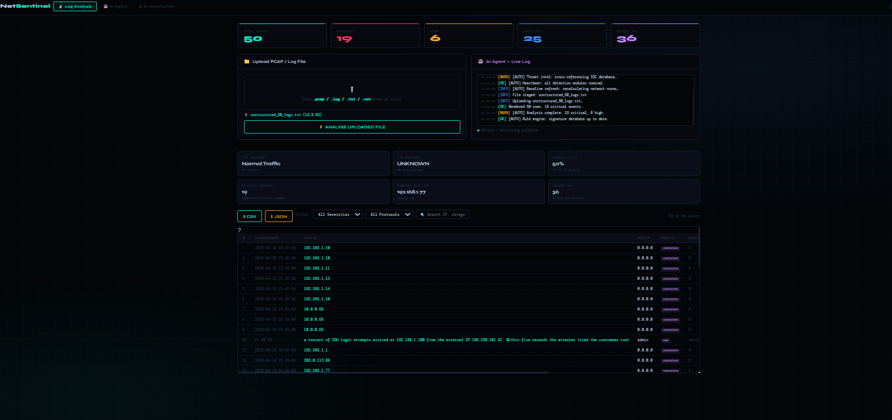

# NetSentinel — AI Automation & Log Analysis Assistant

[](https://www.python.org/)
[](LICENSE)
[]()

**NetSentinel** is a comprehensive AI-powered log analysis and threat detection system built entirely in Python. This single-file application provides enterprise-grade security monitoring capabilities without requiring any external API keys, machine learning models, or complex installations.

## 🚀 Key Features

- **🔍 Advanced Threat Detection**: 25+ rule-based patterns covering port scans, brute force attacks, malware C2, data exfiltration, web attacks, and more
- **🤖 AI Agent Automation**: Natural language generation engine for human-readable threat summaries
- **📊 Risk Scoring Algorithm**: Composite per-host risk assessment with weighted scoring
- **🛡️ Firewall Rule Generator**: Automatic generation of iptables and Windows firewall rules
- **📋 SOC Report Writer**: Complete incident reports in plain English
- **📧 Alert Email Drafter**: Professional alerts for technical and management teams
- **📦 PCAP Parser**: Pure Python packet capture analysis (no external dependencies)
- **🔄 Automation Pipeline**: 7-stage background monitoring and analysis loop
- **📈 Interactive Dashboard**: Sortable, filterable results with real-time updates
- **💾 Multi-format Export**: CSV and JSON export capabilities

## 📸 Screenshots





## 🎯 Demo

**Live Demo**: [View Interactive Demo](https://ai-automation-log-analysis-assistant-net-bfd3.onrender.com)

Watch the step-by-step walkthrough showing threat detection, risk analysis, and automated report generation.

## 📋 Requirements

- **Python**: 3.6 or higher
- **No external dependencies** - Uses only Python standard library
- **No API keys required**
- **Cross-platform**: Windows, Linux, macOS

## 🚀 Quick Start

### Step 1: Download
```bash
# Clone the repository
git clone https://github.com/SAIkrishna1732003/AI-Automation-Log-Analysis-Assistant-Net-Sentinel.git
cd AI-Automation-Log-Analysis-Assistant-Net-Sentinel
```

### Step 2: Run the Application
```bash
# Run with default port (8080)
python sai.py

# Or specify a custom port
python sai.py -p 9090
```

### Step 3: Access the Web Interface
Open your browser and navigate to: **http://localhost:8080**

### Step 4: Login
Use one of the following credentials:

| Role | Username | Password |
|------|----------|----------|
| Administrator | `admin` | `admin123` |
| Security Analyst | `analyst` | `analyst2024` |
| Demo User | `demo` | `demo1234` |

## 📖 Step-by-Step Usage Guide

### 1. **Initial Setup**
   - Launch the application using `python sai.py`
   - Open http://localhost:8080 in your web browser
   - Log in with appropriate credentials

### 2. **Upload Log Files**
   - Navigate to the "Upload" section
   - Support for multiple formats:
     - **PCAP files**: Network packet captures
     - **Text/CSV logs**: Standard log formats
     - **Built-in samples**: 100+ pre-loaded security events

### 3. **Automated Analysis**
   - The AI agent automatically processes uploaded logs
   - **Rule Engine**: Applies 25+ threat detection patterns
   - **Risk Scoring**: Calculates composite threat scores per host
   - **NLG Engine**: Generates human-readable threat summaries

### 4. **Review Results**
   - **Dashboard View**: Interactive table with sortable columns
   - **Threat Categories**: Port scans, brute force, malware, exfiltration, etc.
   - **Risk Levels**: INFO, MEDIUM, HIGH, CRITICAL classifications

### 5. **Generate Security Measures**
   - **Firewall Rules**: Automatic iptables and Windows rules generation
   - **Incident Reports**: Complete SOC documentation
   - **Email Alerts**: Pre-drafted notifications for stakeholders

### 6. **Export & Integration**
   - **CSV Export**: For integration with SIEM systems
   - **JSON Export**: For API consumption
   - **Real-time Monitoring**: Background automation loop

## 🏗️ How It Works

### AI Agent Architecture (No API Keys Required)

1. **Rule Engine** (Python): 25+ pattern-based classifiers
2. **AI Agent** (NLG): Natural language threat descriptions
3. **Risk Scorer** (Algorithm): Weighted composite scoring
4. **Firewall Generator** (Automation): iptables + Windows rules
5. **Report Writer** (NLG): Plain English SOC reports
6. **Alert Drafter** (Templates): Professional email alerts
7. **PCAP Parser** (Pure Python): Network packet analysis
8. **Automation Loop** (Threading): Background monitoring

### Threat Detection Categories

- **Port Scanning**: SYN scans, service enumeration
- **Brute Force**: SSH, RDP, HTTP login attempts
- **Malware C2**: Reverse shells, beaconing, lateral movement
- **Data Exfiltration**: Large uploads, DNS tunneling
- **Web Attacks**: SQL injection, XSS, command injection
- **Network Anomalies**: ARP poisoning, plaintext protocols
- **Ransomware**: File encryption, ransom notes
- **Privilege Escalation**: Kerberoasting, LDAP enumeration
- **Insider Threats**: Database dumps, unauthorized access
- **Cryptomining**: Pool connections, CPU anomalies

## 🔧 Technical Details

- **Single File**: Complete application in one Python file
- **No Dependencies**: Python standard library only
- **Memory Efficient**: Processes large log files without external storage
- **Thread Safe**: Background automation with proper synchronization
- **Cross Platform**: Windows firewall + iptables generation
- **Web Interface**: Built-in HTTP server with session management

## 🤝 Contributing

1. Fork the repository
2. Create a feature branch
3. Add threat detection rules or improve NLG
4. Test with sample logs
5. Submit a pull request

